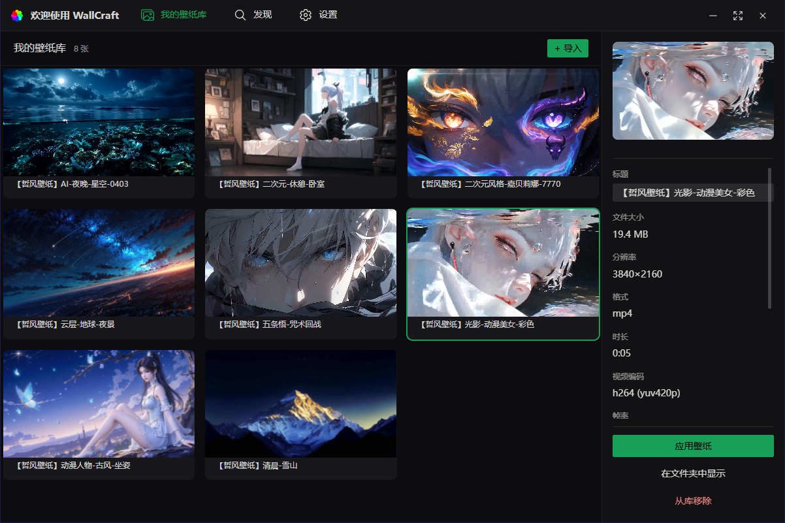

# WallCraft

WallCraft 是一个基于 **Tauri 2**、**Vue 3**、**TypeScript** 和 **Rust** 开发的现代桌面壁纸管理工具。


项目当前聚焦于**本地壁纸管理**、**图片/视频预览生成**、**轻量桌面体验**与**Windows 便携版分发**
。你可以导入本地图片或视频作为壁纸素材，在库中统一管理，并通过后台生成的缩略图和预览获得更好的浏览体验。

基于 Tauri 的跨平台能力，项目具备多平台运行基础。当前配置已包含 **Windows** 与 **Linux** 的打包目标（如 `NSIS`、`deb`、
`AppImage`），其中目前主要开发、测试与便携版分发工作集中在 **Windows** 环境。

## 界面预览



## 功能特性

- 本地壁纸库管理
- 支持从文件或文件夹导入壁纸
- 同时支持图片壁纸和视频壁纸
- 自动生成缩略图与视频预览
- 首次加载时后台渐进生成预览，并提供界面反馈
- 壁纸详情与媒体元数据显示
- Discover 页面支持链接输入与历史记录
- 支持主题、语言与界面外观设置
- 支持视频质量预设和高级参数调整
- 支持缓存清理与日志目录打开
- 支持开机自启
- 支持 Windows 便携版打包

## 技术栈

### 前端

- Vue 3
- TypeScript
- Vite
- Vue Router
- Pinia
- Vue I18n
- Naive UI

### 后端

- Rust
- Tauri 2
- Tauri 插件：
    - dialog
    - fs
    - log
    - autostart
    - single-instance
    - opener

### 媒体处理

- FFmpeg
- FFprobe
- image crate

## 平台支持

- Windows：当前主要开发与验证平台
- Linux：已在打包配置中包含 `deb` 与 `AppImage` 目标
- macOS：基于 Tauri 具备扩展基础，但当前 README 不将其作为已完成验证的平台

## 项目结构

```text
wallpaper-rust/
├─ src/                    # Vue 前端
│  ├─ views/               # Library / Discover / Settings / Home 页面
│  ├─ components/          # 通用组件
│  ├─ stores/              # Pinia 状态管理
│  ├─ api/                 # Tauri invoke 封装
│  └─ utils/               # 日志、媒体工具、本地数据辅助
├─ src-tauri/              # Rust 后端与 Tauri 配置
│  ├─ src/                 # 命令、壁纸库逻辑、平台集成
│  ├─ bin/                 # 打包附带的 ffmpeg / ffprobe 工具
│  └─ tauri.conf.json      # Tauri 应用配置
├─ data/                   # 开发态运行数据
│  ├─ wallpapers/          # 导入后的壁纸资源
│  ├─ previews/            # 生成的视频预览
│  ├─ plays/               # 详情播放缓存
│  ├─ thumbnails/          # 图片缩略图
│  ├─ database/            # 本地 JSON 数据
│  └─ logs/                # 日志目录
├─ portable/               # 便携版输出目录
└─ build-portable.ps1      # Windows 便携版打包脚本
```

## 主要页面 / 模块

### 壁纸库 Library

- 网格方式浏览已导入壁纸
- 显示图片缩略图与视频预览
- 选择并应用当前壁纸
- 显示当前壁纸状态
- 缺失预览时自动后台生成

### Discover

- 输入链接并管理历史记录
- 快速打开链接
- 支持使用系统默认浏览器打开目标地址

### 设置 Settings

- 主题模式与主色设置
- 语言切换
- 视频质量预设
- 硬解码相关选项
- 窗口行为选项
- 缓存管理与日志目录访问

## 开发环境要求

### 基础要求

- Node.js 18+
- pnpm
- Rust 工具链
- Tauri 开发环境依赖

### Windows 额外要求

在 Windows 上开发或打包时，请确保已安装：

- Visual Studio C++ Build Tools 或带 Desktop C++ workload 的 Visual Studio
- WebView2 Runtime

## 安装依赖

```bash
pnpm install
```

## 开发运行

```bash
pnpm run tauri:dev
```

该命令会启动：

- Vite 开发服务器
- Tauri 桌面应用
- Rust 后端

## 仅构建前端

```bash
pnpm run build
```

## 构建桌面应用

```bash
pnpm run tauri:build
```

当前 `tauri.conf.json` 中默认启用了以下打包目标：

- NSIS
- deb
- AppImage

对应平台上可理解为：

- `NSIS`：Windows 安装包
- `deb`：Linux Debian 系发行版
- `AppImage`：Linux 通用分发格式

## 构建 Windows 便携版

先构建正式版本：

```powershell
pnpm run tauri:build
```

然后执行：

```powershell
.\build-portable.ps1
```

该脚本会：

- 复制已构建的可执行文件
- 复制打包附带的 FFmpeg 工具
- 复制 `data/wallpapers`
- 创建 `portable/` 目录
- 生成便携版 ZIP 压缩包

## 运行时数据目录

开发环境下，WallCraft 会在 `data/` 目录下保存运行数据，包括：

- 导入后的壁纸资源
- 自动生成的缩略图
- 自动生成的视频预览
- 详情播放缓存
- 本地 JSON 数据文件
- 日志文件

## 说明

- 视频预览生成依赖打包附带的 `ffmpeg` 与 `ffprobe`
- 首次启动时，缺失的预览可能会在后台逐步生成
- 当前已对预览生成结果做校验，并在正式替换前验证临时文件，以尽量降低预览损坏风险
- 项目当前主要面向基于 Tauri 的桌面端使用场景

## 可用脚本

来自 `package.json`：

```bash
pnpm run dev
pnpm run build
pnpm run preview
pnpm run tauri:dev
pnpm run tauri:dev:devtools
pnpm run tauri:info
pnpm run tauri:build
```

## 致谢

项目中使用的部分壁纸资源来源于 **哲风壁纸**：

https://www.haowallpaper.com/
